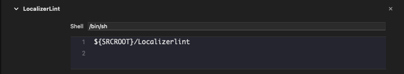
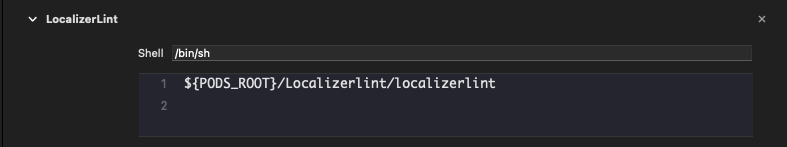
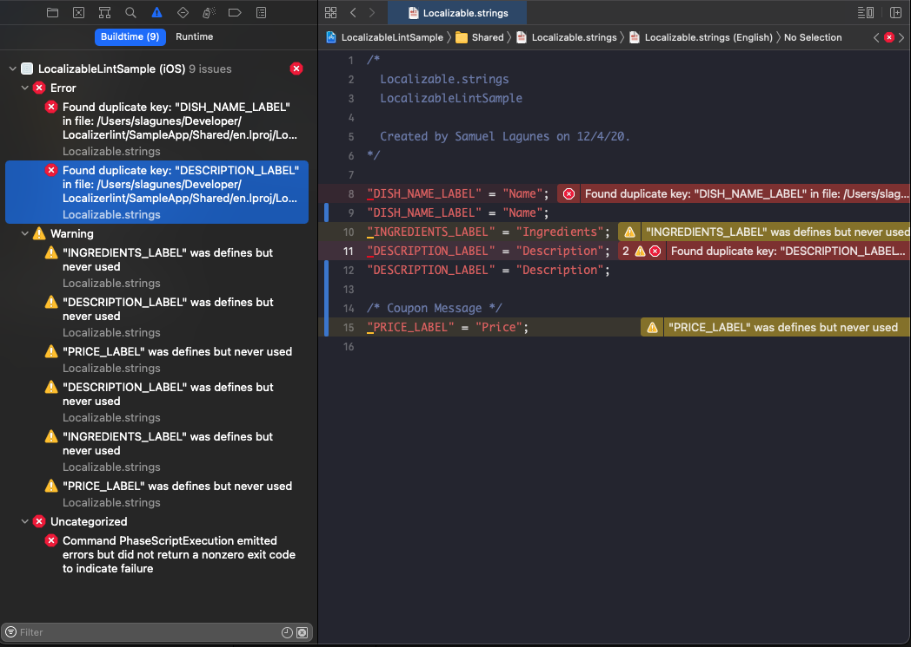

## LocalizerLint

#### This command line tool helps in the search for unused and duplicated localization strings in Xcode projects.

[](https://github.com/xlsmearlx/LocalizableLint/blob/main/LICENSE) 
[](https://github.com/xlsmearlx/LocalizableLint/issues) 


[](https://codecov.io/gh/xlsmearlx/LocalizableLint)

## Installation

### Using [CocoaPods](https://cocoapods.org):

Add the following line to your Podfile:

```
pod 'Localizerlint'
```

This will download the Localizerlint binaries and dependencies in `Pods/` during your next `pod install` execution and will allow you to invoke it via `${PODS_ROOT}/Localizerlint/localizerlint` in your Script Build Phases.


### Using a pre-built package:

You can also install LocalizerLint by downloading `localizerlint.zip` from the
[latest GitHub release](https://github.com/xlsmearlx/LocalizableLint/releases/latest) and running it.

## Usage

	USAGE: localizerlint [<path>] [--search-duplicates-only] [--inclue-swift-ui] [--include-objective-c] [--brute-force] [--strict] [--verbose]

ARGUMENTS	    | Usage
--------------|-------------------------------------------------------------
`\<path\>`    | The root path of the project

>Note: If no `\<path\>` is provided the tool will use the current directory path

Flags                       | Usage                                                                      | Default
----------------------------|----------------------------------------------------------------------------|---------
`--search-duplicates-only`  | Search diplicate keys in Localized Strings files, ignoring any unused keys | `false`
`--inclue-swift-ui`         | Enables analyzer for Localized Strings in SwiftUI Format                   | `false`
`--include-objective-c`     | Enables analyzer for Localized Strings in Objective-C Format               | `false`
`--brute-force`             | Will validate againts all strings                                          | `false`
`--strict`                  | Treats warnings as erros                                                   | `false`
`--reporter`                | Choose output reporter. Available: xcode, json                             | `xcode`
`--verbose`			        | Shows details about the results of running Localizerlint                   |

>Notes:
>
>  `--brute-force` automatically disables `--inclue-swift-ui` and `--include-objective-c`.
> 
> If `--reporter` is set to `json`, the output file will be created at given `path`.

## Example

##### Find duplicate strings

```
$localizerlint Project_Directory/ --search-duplicates-only

Validating for duplicate keys in file: /SampleApp/Shared/en.lproj/Localizable.strings

/SampleApp/Shared/en.lproj/Localizable.strings:8: error: Found duplicate key: "DISH_NAME_LABEL" in file: /SampleApp/Shared/en.lproj/Localizable.strings

/SampleApp/Shared/en.lproj/Localizable.strings:11: error: Found duplicate key: "DESCRIPTION_LABEL" in file: /SampleApp/Shared/en.lproj/Localizable.strings

```

##### Find unused and duplicate strings

```
$localizerlint Project_Directory/

Validating for duplicate keys in file: /SampleApp/Shared/en.lproj/Localizable.strings

/SampleApp/Shared/en.lproj/Localizable.strings:8: error: Found duplicate key: "DISH_NAME_LABEL" in file: /SampleApp/Shared/en.lproj/Localizable.strings

/SampleApp/Shared/en.lproj/Localizable.strings:11: error: Found duplicate key: "DESCRIPTION_LABEL" in file: /SampleApp/Shared/en.lproj/Localizable.strings

Validating for duplicate keys in file: /SampleApp/Shared/es-419.lproj/Localizable.strings

KEYS: 3 | DEADKEYS: 0 | /SampleApp/Shared/en.lproj/Localizable.strings
KEYS: 5 | DEADKEYS: 2 | /SampleApp/Shared/es-419.lproj/Localizable.strings

Searching for unused keys

/SampleApp/Shared/es-419.lproj/Localizable.strings:13: warning: "PRICE_LABEL" was defines but never used
```

## Default search
##### By default the tool will validate againts the following swift syntaxt.
```
//Using NSLocalizedString
NSLocalizedString("MY_LOCALIZED_KEY", comment: "")

//Using Bundle
Bundle.main.localizedString(forKey: "MY_LOCALIZED_KEY", value: "", table: nil)
```

## Searching in Objective-C

##### By enabling the flag `--include-objective-c` the tool will include all `.m` files in the given path and validate using Objective-C syntax.

```
//Using NSLocalizedString
NSLocalizedString(@"MY_LOCALIZED_KEY", @"");

//Using NSBundle
[NSBundle.mainBundle localizedStringForKey: @"MY_LOCALIZED_KEY", value: @"", table: nil];
```

## Searching in SwiftUI
##### By enabling the flag `--inclue-swift-ui` the tool will validate Texts in SwiftUI syntax.
```
struct ContentView: View {
    var body: some View {
        Text("MY_LOCALIZED_KEY") 
    }
}
```

## Xcode Integration

##### This tool is designed to be used as part of Xcode's Build. To integrate it just add a new `run script` phase 

>${SRCROOT}/Localizerlint



##### If using with CocoaPods

>${PODS_ROOT}/Localizerlint/localizerlint



##### After the tools is done searching for unused and duplicated keys, Xcode will display the violations.


